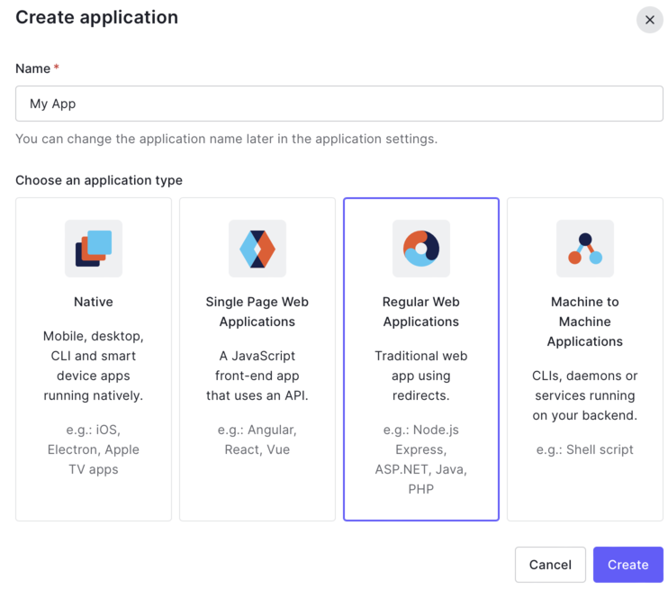

# quickchat

[](https://www.buymeacoffee.com/infiniterik)


A starter project to create a chat application using ChatGPT, Flask, and Auth0.

## Getting started

1. create and activate a virtual environment. I recommend using [`pyenv`]() with the [`pyenv-virtualenv`](https://github.com/pyenv/pyenv-virtualenv) plugin.
2. Install the requirements using `pip install requirements`
3. Set up API Keys
4. Change the default prompt in `components/chat.py` if you wish
4. Run the app using `python server.py`


## API keys
### Set up Auth0

Auth0 makes managing multiple social logins easy.

1. Go to Auth0.com and make an account
2. Go to `Applications` and choose `Create Application`
3. Create a regular web application 
4. Make a `.env` file with the following values:
```
AUTH0_CLIENT_ID=<YOUR_CLIENT_ID>
AUTH0_CLIENT_SECRET=<YOUR_CLIENT_SECRET>
AUTH0_DOMAIN=<YOUR_AUTH0_DOMAIN>
```
These values will be explicitly loaded by us in our code. Look for `env.get(...)` calls.

5. Under `Application URIs`, add `http://localhost:3000/callback` to `Allowed Callback URLs`
6. In the same section, add `http://localhost:3000/welcome` to `Allowed Logout URLs`
7. You will have to change those values accordingly if you deploy the app somewhere other than `http://localhost:3000`


### Setting up OpenAI

1. Make an account with OpenAI
2. Create a new API key and add it to the `.env` file
```
OPENAI_API_KEY=<YOUR_OPENAI_API_KEY>
```
This value will be implictly loaded by the `openai` library.

### Additional security concerns

Authentication in this app is done using [jwt](http://jwt.io) which are signed cookies containing the user identity. The jwt cookie is a bearer token, meaning that if someone else has that token, they can impersonate your user. If you use this app in the real world, you will need `https` to secure client-server communications so the cookie can't be intercepted. When you do enable `https`, you should also set `SESSION_COOKIE_SECURE=True` for flask.

The other half of this is that your users jwt is signed by flask, which means flask needs a [secret key](https://flask.palletsprojects.com/en/2.2.x/config/#SECRET_KEY). If someone can guess your secret key, they can make their own user tokens. By default, the `SECRET_KEY` is `None`. You can add a secret key of your choice to the `.env` file:
```
APP_SECRET_KEY=<YOUR_SUPER_SECRET_KEY>
```
These values will be explicitly loaded by us in our code. Look for `env.get(...)` calls.
It might be a good idea to use a specialized tool to generate a random key.